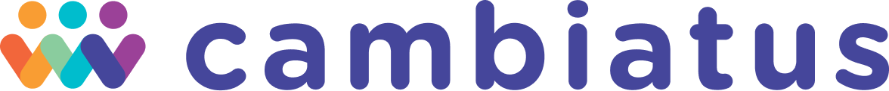
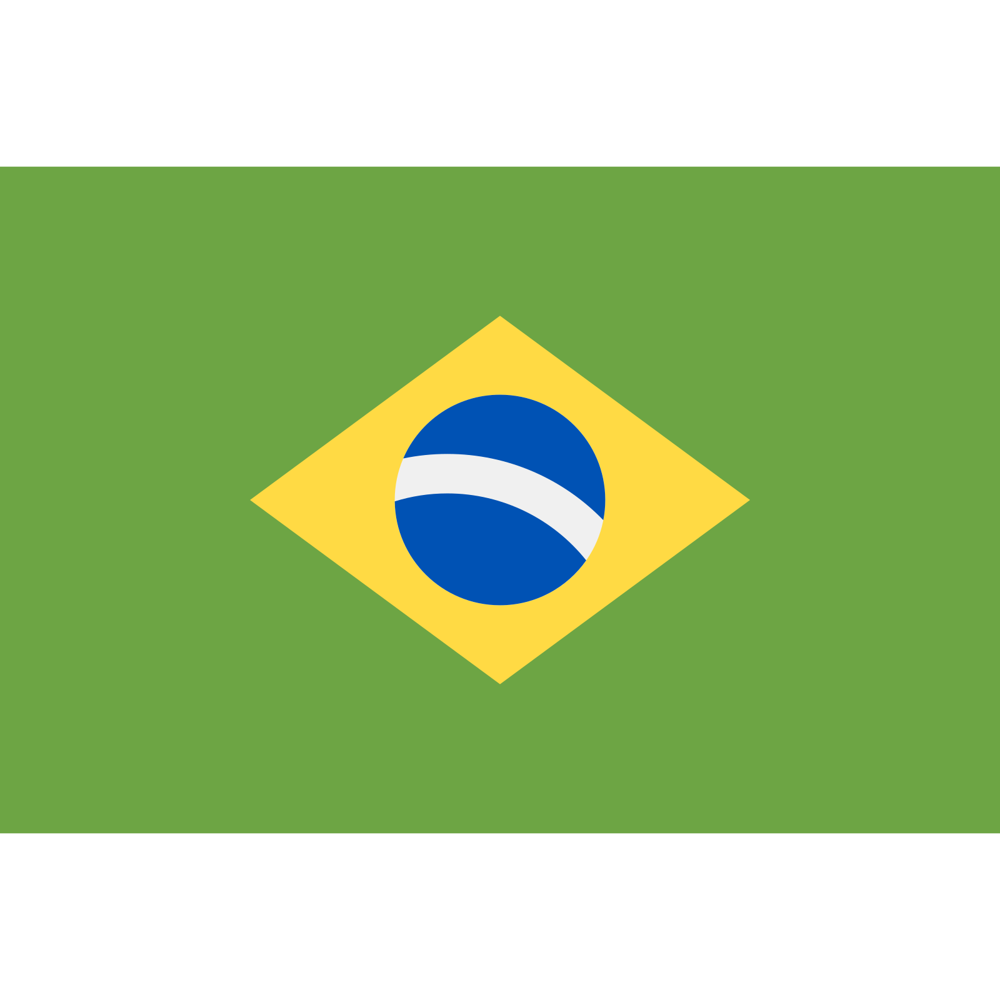
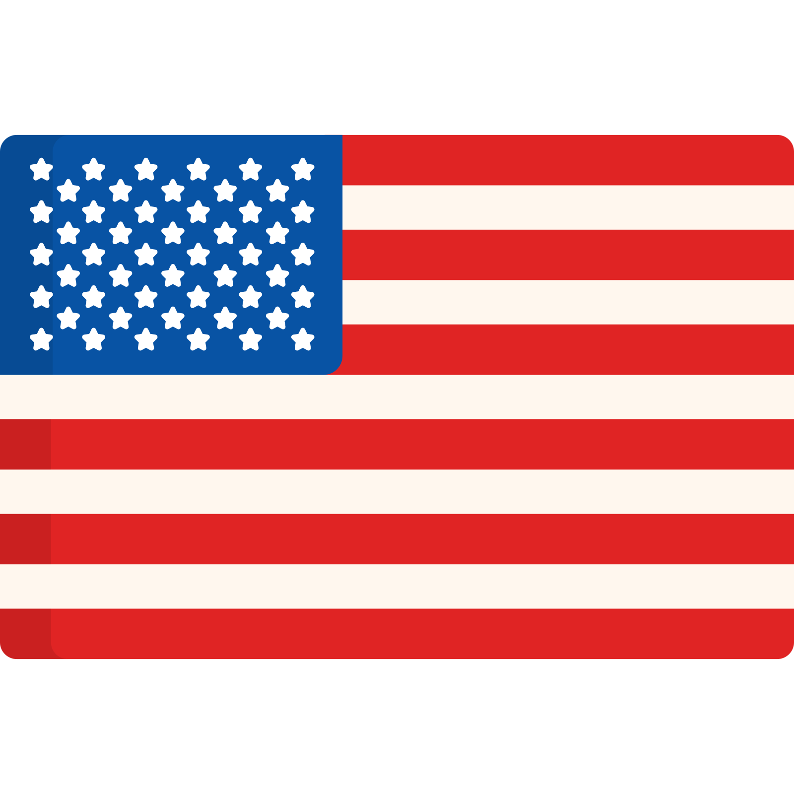

# 
Trilha de Aprendizagem

**Estamos muito felizes pelo seu interesse em criar sua moeda social usando Cambiatus.**

Nosso processo de co-desenho de moedas começa com a mudança de mindset. Para conseguirmos desenhar moedas complementares, precisamos ressignificar o que é dinheiro, o que é sucesso, e imaginar novas organizações. 

Por isso, separamos alguns materiais importantes para que você possa trilhar **seu próprio caminho** e aprender no seu próprio ritmo sobre alguns temas inovadores e transformadores. Este documento contém conteúdos em português , espanhol , e também inglês , sempre sinalizados, que são alguns dos idiomas que utilizamos.

Primeiro, gostaríamos de te apresentar a **Cambiatus**:
>Somos uma plataforma de código aberto que ajuda na criação de novas organizações, por meio de moedas sociais em Blockchain.

[Aqui](https://www.youtube.com/watch?v=R5SGTaFCsgU "This is Cambiatus")  falamos sobre o trabalho que realizamos e como impactamos a vida de pessoas e comunidades no mundo.

## Blockchain
Queremos apresentar uma tecnologia com potencial transformador. A principal diferença entre as moedas sociais criadas usando Cambiatus e as outras citadas, é que nós utilizamos a tecnologia blockchain. E você deve estar se perguntando: [o que é blockchain e pra que isso serve?](https://blog.pabloreyes.es/que-diablos-es-blockchain/ "¿Qué diablos es Blockchain?") 

>De uma maneira simples, podemos dizer que o Blockchain é um banco de dados público no qual os eventos digitais são gravados e distribuídos entre muitas pessoas. Essa base pode ser atualizada quando houver consenso entre os participantes, e a partir daí as novas informações serão salvas com segurança e não poderão ser excluídas posteriormente. 

Em resumo: blockchain **serve para transferir valor entre as pessoas sem a necessidade de intermediários**. Isso quer dizer que as moedas que utilizam Cambiatus não necessitam de instituições financeiras e nem governamentais para fazer trocas de valor entre si.

[Neste vídeo](https://www.youtube.com/watch?v=hYip_Vuv8J0&t "Blockchain Expert Explains One Concept in 5 Levels of Difficulty") , Bettina Warburg explica o que é a tecnologia para diferentes faixas etárias. [Este artigo](https://tecnoblog.net/responde/como-funciona-blockchain-bitcoin/ "O que é blockchain? [indo além do bitcoin]")  também explica o que é blockchain, e um pouco de sua história.

Por isso, achamos que você pode estar se fazendo outra pergunta: mas e o bitcoin? Onde ele entra nisso tudo? O Bitcoin foi a primeira aplicação da tecnologia blockchain, e depois dele vieram diversas outras redes, principalmente focadas em contratos inteligentes, ou smart contracts, com, diferentes características e funcionalidades, como a Ethereum, CELO, Harmony, Algorand ou a EOS, usada na Cambiatus. [Neste video](https://www.youtube.com/watch?v=goC8QYVqdCA "Transmissão ao vivo de Espírito HUB") , Luiz Hadad faz uma breve introdução ao que é blockchain e suas possíveis aplicações (a fala inicia no minuto 55) e vai te explicar melhor sobre essa blockchain.

Mas então, qual a razão de utilizarmos essa tecnologia na implementação de moedas sociais? A blockchain oferece descentralização, transparência e segurança na transmissão de dados. Esses recursos podem ser explorados para muitas aplicações em trocas monetárias, rastreabilidade de produtos, contratos inteligentes e até sistemas de votação. [Este vídeo](https://www.youtube.com/watch?v=7DzdQPsjzis&t= "Aplicaciones del blockchain: lo que está por venir")  fala sobre algumas aplicações da tecnologia. [Já este aqui](https://www.youtube.com/watch?v=Pl8OlkkwRpc "How the blockchain is changing money and business")  aborda a mudança que a blockchain está promovendo no mundo financeiro e dos negócios.

Aqui [neste artigo](https://medium.com/el-blog-de-sustainability-school/blockchain-y-las-tendencias-culturales-de-m%C3%A1s-impacto-5f18ae707f4e "Blockchain y las Tendencias Culturales de más impacto") , Karla Córdoba destaca a seleção da tecnologia como uma das Tendências Culturais pela agência Sparks & Honey. Mas, para além do universo financeiro, existem [muitas aplicações](https://www.apd.es/aplicaciones-blockchain/ "7 aplicaciones de la tecnología blockchain")  para a tecnologia blockchain.

## DAOs, novas organizações e futuros desejáveis
Uma dessas aplicações são as DAOs, (sigla, em inglês, para Organizações Autônomas Descentralizadas). 
>DAOs são comunidades que operam e tomam decisões com base em regras codificadas em programas de computador chamados contratos inteligentes. 

Na Binance Academy, temos um [guia interessante sobre DAOs](https://academy.binance.com/pt/articles/decentralized-autonomous-organizations-daos-explained "Guia Sobre Organizações Autônomas Descentralizadas (DAOs)") . [Aqui](https://www.youtube.com/watch?v=Pyi8-qm02hs "Decentralized Autonomous Organization"), temos uma explicação em vídeo, já [neste artigo](https://newsletter.banklesshq.com/p/how-crypto-is-regenerating-the-world?s=r "How Crypto is Regenerating the World")  Kevin Owocki fala sobre o conceito de DAOs de impacto, e mostra exemplos que estão colaborando com este movimento.

Por isso, [aqui](https://www.youtube.com/watch?v=RiheJnqoKcY "Las organizaciones del futuro, hoy") , Karla Córdoba fala sobre o modo que moldamos nossas organizações e possibilidades para as organizações do futuro. A transparência e descentralização da blockchain ajuda a eliminar a corrupção e a intermediação de terceiros nas transações, o que permite que organizações e comunidades operem sem a necessidade de uma autoridade central. As DAOs permitem que uma rede de pessoas ou entidades defina suas próprias regras de colaboração para atingir seus objetivos comuns. 

Enquando organização, nós da Cambiatus também integramos o [Exit to Community](https://www.colorado.edu/lab/medlab/2020/08/31/exit-community-community-primer "Exit to Community") , um movimento global que busca criar uma alternativa ao tradicional *"exit"* do mundo das *startups*. [Neste vídeo](https://www.youtube.com/watch?v=IdwzoJhD9aQ "Exit to Community: A new option for the startups we love")  Lauren Ruffin explica o pensamento que envolve o amadurecimentos das organizações e o empreendedorismo voltado para as comunidades.
 
Todo esse trabalho é fruto do surgimento de novos tipos de organização. [Neste vídeo](https://www.youtube.com/watch?v=QwwtFr607jw&t "Monedas sociales y blockchain") , Karla Córdoba, iniciadora da Cambiatus, fala sobre Moedas Sociais e Blockchain. Essas organizações são ferramentas que podemos utilizar na construção de futuros desejáveis. [Neste vídeo](https://www.youtube.com/watch?v=SD1c1ms8Pl0&t "Tools to build desirable futures")  Luiz Hadad, líder de construção de comunidades na Cambiatus, fala como blockchain e ESG podem ser ferramentas nesta direção,. ESG, sigla em inglês para ambiental, social e governança, corresponde a um espectro que baliza ações de organizações comprometidas com a sustentabilidade do planeta. Isso não significa que devemos nos ater à sustentabilidade. Devemos ir além e buscar a regeneração. Lala Deheinzelin, [neste TED](https://www.youtube.com/watch?v=HoAi9jjm43w "Criando Comunidades Criativas e Colaborativas") , nos ensina a construir comunidades criativas e colaborativas, para construir futuros desejáveis.

As práticas da ESG, e também com os [Objetivos de Desenvolvimento Sustentável](https://brasil.un.org/pt-br/sdgs "Objetivos de Desenvolvimento Sustentável | As Nações Unidas no Brasil") , são compromissos que estabelecemos a partir do entendimento que o mundo já está em mudança. [Neste vídeo](https://www.youtube.com/watch?v=xguam0TKMw8 "Principles for Dealing with the Changing World Order") , Ray Dalio nos explica sobre alguns ciclos que a história nos mostra, sobre mudanças glocais. E será que o futuro tende a se repetir? Ou será que podemos reinventar a forma de nos organizar, e mudar nosso paradigma financeiro, social e econômico?

## Economia, dinheiro e moedas sociais

Para que essas mudanças sejam possíveis, é preciso repensar boa parte da cultura em nossa sociedade. [Aqui](https://www.youtube.com/watch?v=-GoFzU3cRE4 "Sacred Economics") , Charles Eisenstein reflete sobre a história do dinheiro desde as economias mais antigas. Já [neste vídeo](https://www.youtube.com/watch?v=M4ThwS1Xln0 "Why money needs to change now")  Bernard Lietaer, importante teórico sobre moedas sociais, também fala sobre a urgência da mudança do dinheiro como conhecemos, advogando por um ecossistema financeiro, que busque e privilegie a resiliência econômica, ante a eficiência - esta é a verdadeira raiz de nossos problemas. 
>O sistema financeiro atual mantém o monopólio da criação do dinheiro na mão de poucas instituições, e o desenho do dinheiro criado, por meio de dívida, tem como efeito a manutenção do *status quo*: concentração de riquezas, pressão extrativista sobre os recursos da terra e crises econômicas cíclicas.

Se alguma vez você já se perguntou “o que é dinheiro? Como ele é criado?”, “Como ele é controlado?”, provavelmente você também já questionou “e se tivéssemos o poder de criar o nosso próprio dinheiro?”. Aqui, te apresentamos alguns livros como [“Nuevo dinero para la sostenibilidad”](https://payhip.com/b/dtFf "Nuevo dinero para la sostenibilidad") , [“Cómo crear nuestro dinero y construir sostenibilidad”](https://payhip.com/b/stIi "Cómo crear nuestro dinero y construir sostenibilidad") , e [“This is the Mutual Credit Clearing System”](https://payhip.com/b/qGOz "This is the Mutual Credit Clearing System") , onde você pode se aprofundar.

E são por questionamentos como esses que estamos tratando do conceito de moedas sociais. [Neste artigo](https://medium.com/el-blog-de-sustainability-school/dinero-y-sostenibilidad-c6d1a2b7d9a8 "Dinero y Sostenibilidad: ¿por qué es una relación tan poco comprendida?") , Ranulfo Paiva explica a relação entre dinheiro e sustentabilidade. Já [aqui](https://www.elmagacin.com/las-10-monedas-sociales-mas-interesantes-del-mundo/ "Las 10 monedas sociales mas interesantes del mundo") , você pode ler sobre algumas das moedas sociais mais interessantes do mundo.

[Aqui](https://www.youtube.com/watch?v=g_M-aJgCKYc "Monedas Sociales") , temos um interessante documentário sobre moedas sociais. Existem exemplos de bancos comunitários que utilizam moedas sociais que não necessariamente são digitais, como a [Rede Alegrias](https://www.youtube.com/watch?v=khS2JE1rEIM "Rede Alegrias") , o [Palmas](https://www.youtube.com/watch?v=vxuMhwuRaFU "Palmas") , no Ceará, e a [Mumbuca](https://www.youtube.com/watch?v=q8S2enuj9-M "Conheça a Moeda Mumbuca") , no Rio de Janeiro.

## Nossas comunidades

As moedas complementares que utilizam a Cambiatus convergem dessa mudança de mindset e são usadas por grupos organizados de pessoas para promover suas ações e objetivos comuns. Outra convergência envolve a preocupação social e ambiental. [Neste artigo](https://medium.com/cambiatus/cambiatus-na-constru%C3%A7%C3%A3o-da-rede-de-parceiros-6a755e27dd8d "Cambiatus e seus membros: co criando moedas sociais e negocios colaborativos") Juliana Ramos discorre sobre o processo de co-criação das nossas moedas. 

* ### [Sistema Natus](https://www.cambiatus.com/pt-br/pilots-natus "Sistema Natus")
O Sistema Natus de Criptoativos Ambientais é uma iniciativa inovadora que reúne empresários, proprietários de Reservas Ambientais Privadas (PPA) e usuários com o melhor da tecnologia blockchain para fortalecer a rede global de PPAs.

Funciona a partir da adesão de uma reserva, onde uma equipe técnica analisa os benefícios ambientas geradoos. Assim se originam os Natus-Units, certificados digitais que representam os benefícios gerados no período de um ano. [Neste vídeo](https://www.youtube.com/watch?v=X-wrnWL1NF0&t "Sistema Natus de Criptoativos Ambientais: Como funciona e como participar")  temos uma conversa sobre como aderir ao sistema e como ele funciona.

* ### [Verdes](https://www.cambiatus.com/pt-br/pilots-verdes "Verdes")
A Verdes, uma moeda social que promove ações verdes conscientes e recompensa o voluntariado, enquanto reativa a economia local apesar dos efeitos negativos da pandemia de Covid-19 no turismo, o principal fonte de atividade econômica da região. Localizada em Monteverde, na Costa Rica, onde promove a economia circular e uma rede de trocas.

[Aqui](https://www.youtube.com/watch?v=qRphrJpdrwE "Los Verdes: La nueva moneda local de Monteverde")  temos uma introdução acerca dessa moeda e sua utilização. Já [neste vídeo](https://www.youtube.com/watch?v=HXt2fuDgYfc "OPEN Session: Verdes (Costa Rica)")  temos uma sessão aberta promovida pela Cambiatus que se aprofunda um pouco mais a respeito dessa nossa comunidade. Ainda, [aqui neste artigo](https://medium.com/cambiatus/verdes-a-moeda-social-que-alia-sustentabilidade-e-resili%C3%AAncia-econ%C3%B4mica-72c989f9da92 "Verdes: a moeda social que alia sustentabilidade e resiliência econômica")  Críscia Cesconetto fala sobre sustentabilidade e resiliência econômica promovidas pela moeda.

* ### [Muda](https://www.youtube.com/watch?v=1NtGs7QjtJw "Muda")
A Muda é uma comunidade virtual iniciada por um grupo de artistas, professores, fazedores culturais, empreendedores sociais, surfistas, hackers, produtores e sonhadores. Estruturada como uma rede de fomento, busca incentivar ações culturais, educativas e socioambientais que muitas vezes não são contempladas pelo sistema financeiro tradicional.

Com a chegada da pandemia os iniciadores da Muda elaboraram um projeto para apoiar a comunidade de artistas que tiveram sua renda afetada pelo isolamento social. Afim de subverter formas excludentes de se pensar a economia, foi criada uma moeda social complementar, a MUDA, hospedada pela Cambiatus. Com início de sua operação em dezembro de 2019, a plataforma já conta com mais de 4.000 membros e 800 ofertas em sua loja P2P. [Nesta sessão aberta](https://www.youtube.com/watch?v=1NtGs7QjtJw)  apresentamos a maior comunidade em operação da Cambiatus.

* ### [Play4Change](https://www.cambiatus.com/pt-br/pilots-play4change "Play4change")
A [mais recente comunidade](https://www.youtube.com/watch?v=ZF5rNJepU44)  usando Cambiatus, a Play4Change acredita que a blockchain pode capacitar a população sem acesso a bancos a ultrapassar o sistema bancário muito caro e arcaico e ter acesso a serviços financeiros anteriormente inacessíveis. 

Nasceu com o propósito de gerar inclusão financeira, empoderamento educacional e transformação social alavancando jogos blockchain Play 2 Earn, e atualmente, além de apoiar jogadores, realiza sessões educacionais semanalmente, abrangendo hard skills como blockchain, cripto, alfabetização financeira, como usar carteiras digitais, bem como soft skills como liderança, comunicação e criatividade. [Neste artigo](https://medium.com/cambiatus/play4-change-se-junta-ao-ecossitema-da-cambiatu-625fe791036b)  anunciamos sua adesão à nossa plataforma.

* ### [Agelgil](https://www.cambiatus.com/pt-br/pilots-agelgil "Agelgil")
Formada e liderada por mulheres, a Agelgil, localizada em Adama, na Etiópia, é uma comunidade formada por grupos de auto-ajuda. Em Adama, os grupos de autoajuda (SHG) costumam reunir de 15 a 20 pessoas, todas as semanas, para se apoiarem financeiramente e se encorajarem mutuamente. Eles começam economizando pequenas quantias regularmente, e então começam a contrair pequenos empréstimos do grupo a uma taxa de juros baixa. Os membros costumam usar o dinheiro para iniciar ou expandir seus próprios negócios. Eles também recebem treinamento para pequenas empresas, onde muitos destes grupos são compostos inteiramente por mulheres.

Um agelgil é um recipiente etíope tradicional para manter os alimentos frescos e transportá-los enquanto trabalha no campo. Você carrega alimentos com você e também é capaz de compartilhá-los com outras pessoas. Este é o símbolo que nosso piloto comunitário na Etiópia escolheu para sua moeda complementar, o AGL. [Aqui nesta sessão aberta](https://www.youtube.com/watch?v=DZNNXfWsIrs "Open Session: Agelgil (Ethiopia)")  podemos conhecer mais profundamente a comunidade, e [neste artigo](https://medium.com/cambiatus/agelgil-mulheres-e-resili%C3%AAncia-financeira-na-%C3%A1frica-55e27b8cd683 "Agelgil: mulheres e resiliência financeira na África") , Críscia Cesconetto fala sobre resiliência financeira e o processo de co-desenho e a adesão da Agelgil à Cambiatus.

Estmamos muito contentes com essa trilha! Agora, recomendamos também este conteúdos complementares: 
* [Moedas Complementares em Blockchain como Mecanismo de Incentivo: Por que apoiá-las?](referenciascientificas.md "Moedas Complementares em Blockchain como Mecanismo de Incentivo: Por que apoiá-las?")
* [Como iniciar seu grupo de estudos em 4 passos](grupodeestudos.md "Como iniciar seu grupo de estudos em 4 passos")

Continuamos abordando estes e outros assuntos nas nossas redes:

[Medium](https://medium.com/cambiatus "Medium") | [Youtube](https://www.youtube.com/channel/UCIyb1r-Mj12veCMIB-EEzaA/featured "Youtube") | [Twitter](https://twitter.com/_cambiatus "Twitter") | [Linkedin](https://www.linkedin.com/company/cambiatus/about/ "Linkedin") | [Instagram](https://www.instagram.com/cambiatus/ "Instagram") | [Facebook](https://www.facebook.com/Cambiatus "Facebook")

